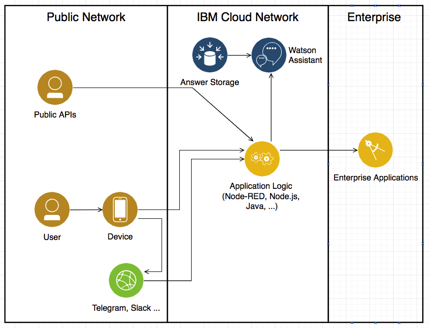

# Chatbot with Telegram

Simple flow to converse with the Watson Assistant service from via Telegram bot.

- create a Watson Assistant service
- create a Telegram bot, see https://core.telegram.org/bots
- install Node-RED
- import the flow 
- enter credentials of the **Telegram receiver node** , the **Ask WA service** (use basic authentication) node, and the **send to Telegram** node

The picture shows a typical (simple) architecture with Watson Assistant:
